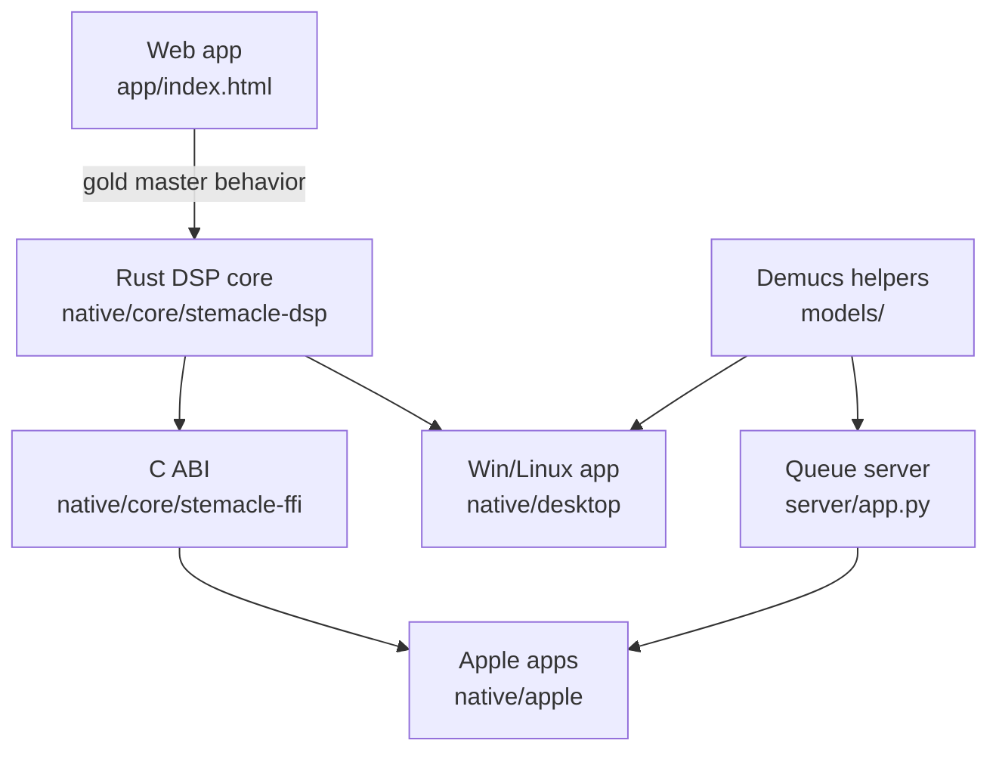

# Stemacle Development Guide

This is the practical map for working in the repo. The shorter version is: web
behavior lives in `app/index.html`, native product work lives in `native/apple`
and `native/desktop`, and shared signal-processing behavior belongs in
`native/core`.

## Architecture



The browser app remains the reference for playback behavior, visual hierarchy,
loop semantics, and the physical/tactile interaction model. The native surfaces
should match that first, then add platform-specific advantages.

## Working On The Web App

The canonical web splitter is a single HTML file at `app/index.html`. It is big
because it carries the UI, Web Audio work, model loading, fallback DSP, loop
logic, and browser compatibility behavior in one place.

When changing it:

- Preserve `/app/` as the canonical working surface.
- Keep the legacy `stem-player/` path as a redirect/handoff, not a fork.
- Run `npm test` after structural changes.
- Run `node --test tests/browser-parity.browser.mjs` when playback, browser
  globals, decoding, or visual behavior changes.
- If DSP math changes, update the Rust core or explain why parity should drift.

## Working On Apple Apps

Apple code lives in `native/apple`.

- `Stemacle/` contains the shared SwiftUI app views and app shell.
- `StemacleKit/` contains Swift package code that wraps native helpers and the
  Rust FFI.
- `StemacleCore.xcframework` is generated from `native/core/stemacle-ffi`.
- `project.yml` is the XcodeGen source for `Stemacle.xcodeproj`.

Useful commands:

```bash
npm run apple:project
npm run apple:xcframework
xcodebuild -project native/apple/Stemacle.xcodeproj \
  -scheme StemacleMac \
  -configuration Debug \
  -destination 'platform=macOS' build
xcodebuild -project native/apple/Stemacle.xcodeproj \
  -scheme StemacleiOS \
  -configuration Debug \
  -destination 'platform=iOS Simulator,name=<available simulator>' build
```

If a change affects both macOS and iOS, keep the shared SwiftUI surface honest.
Desktop can add file-system power; iOS can add document picker, touch, haptics,
and share sheet behavior. Neither should redefine the core splitter.

## Working On Windows/Linux Desktop

The Slint app lives in `native/desktop`.

- `src/main.rs` wires UI events.
- `src/player.rs` owns loading, separation, mixing state, and export.
- `src/playback.rs` owns audio output.
- `src/demucs.rs` detects and runs the optional high-quality Demucs path.
- `ui/stemacle.slint` owns the Slint UI.

Useful commands:

```bash
npm run desktop:test
npm run desktop:build
npm run desktop:run
```

The Slint surface currently lags the Apple/web splitter in some parity areas.
Check [docs/FEATURE_MATRIX.md](./FEATURE_MATRIX.md) before assuming a feature is
implemented everywhere.

## Working On The Rust Core

The Rust core is the shared native implementation of deterministic DSP and loop
math.

- `stemacle-dsp` owns FFT, STFT/ISTFT, HPSS, tempo detection, visualization data,
  and loop helpers.
- `stemacle-ffi` exposes the core to Swift through a C ABI.
- Golden parity fixtures live in `fixtures/golden/`.

Useful commands:

```bash
npm run core:test
npm run core:fmt
npm run core:build
npm run golden:gen
```

Core changes should come with tests. If a change intentionally moves away from
the browser gold master, document that in the test or the relevant product doc.

## Working On Models

Model notes live in [models/README.md](../models/README.md). The current rule of
thumb is:

- The deterministic DSP path must always work.
- Demucs is a quality upgrade, not a hard dependency.
- Desktop can shell out to `models/separate.py`.
- Mobile clients can use the optional queue server.
- Converted CoreML/ONNX artifacts are staged work and should be treated as
  platform-specific model plumbing, not core DSP logic.

## Working On The Queue Server

The optional FastAPI server lives in `server/app.py`; its README is
[server/README.md](../server/README.md).

Run it with:

```bash
models/.venv-models/bin/uvicorn server.app:app --host 0.0.0.0 --port 8008
```

It is intentionally small: in-memory jobs, local temp files, and stem download
endpoints. Good enough for local/full-quality experiments; not a scaled hosted
service without a real queue, storage, and auth.

## Removed Script Drift

The repo has been rewritten from older web-wrapper packaging toward native
SwiftUI and Slint apps. The old Electron, Capacitor, `native/macos`, and
`native/ios` package aliases have been removed from `package.json`, and CI now
checks the current surfaces instead of the deleted wrapper paths.

Current source of truth:

- Apple: `native/apple`
- Windows/Linux: `native/desktop`
- Shared native DSP: `native/core`
- Web: `app/index.html`

Removed aliases/files:

- `native:prepare`
- `macos:*`
- `windows:*` / `linux:*` Electron-builder packaging
- `webui:dev`
- `ios:add`, `ios:sync`, `ios:open`
- `scripts/prepare-native.mjs`
- `scripts/package-macos.mjs`
- `scripts/serve-native.mjs`
- `scripts/desktop-dispatch.mjs`

Desktop release packaging is intentionally not wired up yet. iOS release commands
remain live through `scripts/ios-release.sh`.

## Before Opening A PR

Run the checks relevant to the surface you touched:

```bash
npm test
npm run site:prepare
cargo test --manifest-path native/core/Cargo.toml
cargo test --manifest-path native/desktop/Cargo.toml
```

For Apple work, also run the matching `xcodebuild` command from the Apple
section. For browser behavior changes, run the browser parity suite if Chromium
is available.
